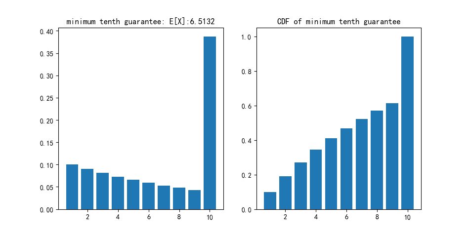
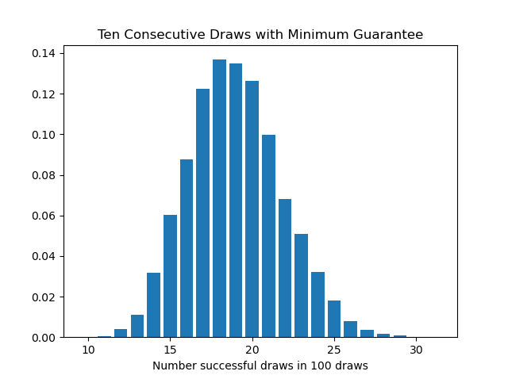
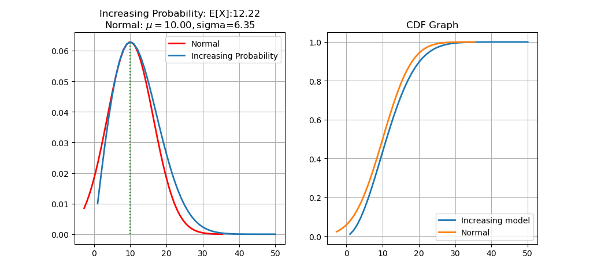
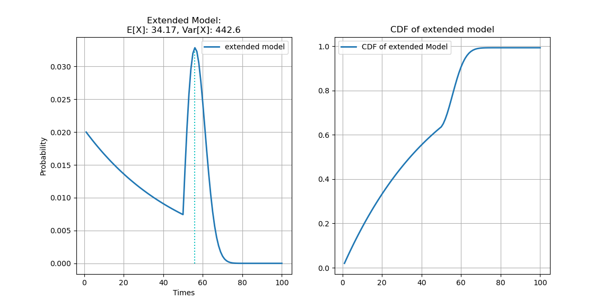
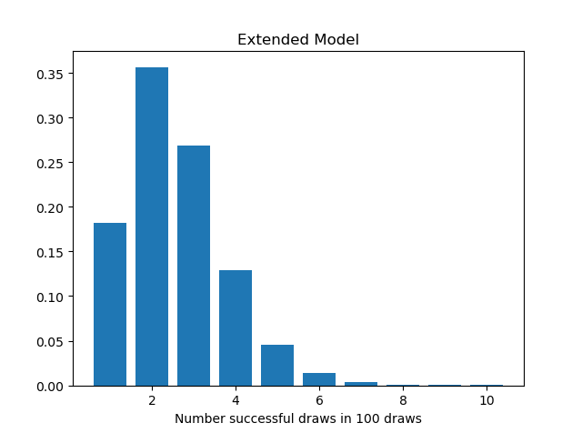

# 游戏抽卡概率模型

目前的中国游戏市场，最热门的莫过于免费抽卡手游。游戏厂商为了盈利，设计出有不同规则的卡池，让玩家抽卡获取稀有的人物和武器。这一机制吸引了很多玩家，首先因为手游是免费的，入手门槛较低，其次很多人喜欢抽卡获取角色和武器的成就感。为了更吸引玩家，游戏策划就得设计出能够让大部分玩家，无论是欧皇还是非酋满意的抽卡机制。本文将简要分析目前游戏厂商可能使用的抽卡机制（仅属于个人猜想加一些网上的资料）。

### 抽卡机制的大致分类

1. 最简单的抽卡模型就是每次抽卡的概率都是固定的，也就是说每次抽卡的概率都是$p$,我们可以称之为纯随机。那么玩家第$n$次抽中的随机变量分布就是一个几何分布。这种抽卡模型很明显对于非酋非常不友好，理论上可能存在抽了很多很多次仍然没有抽中的人存在。所以纯随机模型在抽卡游戏中是不会使用的。
2. 对应于纯随机的，我们可以称之为伪随机（注意这里的伪随机和计算机随机数概念中的伪随机不是一个东西）。伪随机就是说每次抽卡的概率都是是会进行改变的。下面就重点介绍几种可能的伪随机模型

### 伪随机模型

- #### 十连保底 

  十连保底应该是我们在游戏中最常见到的概率模型。如果连抽十次，前九次都没有抽中的话，那么第十次就必定会抽中。这种概率模型会导致很多玩家都是依靠十连保底，并且概率质量函数图像会在第十次突然上升，显得不均匀。

  例如，如果我们设定抽到A卡的概率为0.1，那么我们得出的该概率质量函数和累积分布函数的图像就是下图。可以算出数学期望为6.5，并且大约60%的玩家在前9次抽到，而所谓的非酋也就是触发保底的玩家占到了40%。

  

  如果我们用程序模拟10000次在这种概率模型下的抽卡，我们可以得出下面的分布。从图中可以看出，大部分玩家抽100次会得到16-20个想要得到的。

  

  这种十连保底的模型一般用于四星角色或者武器。四星虽然没有五星稀有，但是也是需要一定的保障以确保玩家甚至连四星都抽不到。

- #### 概率增加模型

  那么对于更加稀有的五星角色和武器来说，十连保底肯定就显得太过容易了。这个时候策划一般希望玩家差不多抽几十发可以抽中一个，所以就需要比如100抽保底这样的机制。但是如果这个时候继续采用以上的前面的概率都不变，那么很容易想到这样子的话大部分玩家都会是100发保底...所以就需要调整该概率。

  首先，我们设定一个初始概率$p$，然后如果没有抽中，那么下一次抽卡概率就给他一个增量$\alpha$，如果抽中，那么就回归初始概率。所以，第X次抽中的概率就是$p(x)=p+\alpha\times (x-1)$，概率质量函数$P(X)=\Pi^{x-1}_{i=1}\lbrack(1-p(i))\rbrack\times p(x)=\Pi^{x-1}_{i=1}[(1-p-\alpha\times(i-1))]\times(p+\alpha\times(x-1))$ 

  我们设定$p=0.01, \alpha=0.01$，然后画出图像之后发现，这个图像居然很像是一个正态分布的图像，所以顺便把正态分布的图像画了出来对比，虽然也不知道为什么这两张图这么像。

  

  在这个概率模型下，由于100次的时候$p(100)=0.01+99\times0.1=1$，所以实现了一个100抽保底的效果。但是策划希望的是100抽保底，并且大部分人应该是在五六十抽的时候抽到的，而在这个模型中，超过90%的人在前二十抽就抽到了，这显然不符合预期。所以在这个模型的基础上，我们需要进行相应的调整，让模型的最高点向右偏移。我们由此可以使用一下模型：前50次抽卡概率固定，后50次抽卡使用上面的模型，每次抽卡概率增加。这样我们得出的该概率质量函数就是
  $$
  p(x)=
  \begin{cases}
  p, & x<50 \\
  p+\alpha(x-50), &x>=50
  \end{cases}
  $$
  和上面一样，如果需要满足100抽保底的话，让$p=0.02,\alpha=0.02$。其概率质量函数和累积分布函数图像如下：

这张图我认为说可以用作五星的概率模型了。70发之前大部分人都能够抽到，并且集中在40发到70发，占了43.69%。这也可以视作游戏玩家口中的“低保”。

我们使用上面的模型模拟10000次100连抽，得到的结果如下：

这个结果个人认为就非常像真实游戏中的结果了，大部分人都只能够抽到1-2发，并且很多人都是依靠低保的（这很真实）

------

### 参考资料

[明日方舟抽卡概率和保底机制研](https://www.40407.com/zixun/7986.html)
[游戏抽奖概率模型](https://www.jianshu.com/p/031e53e8553c)

 

